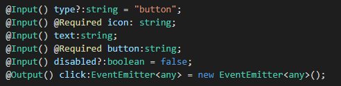
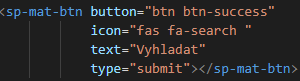
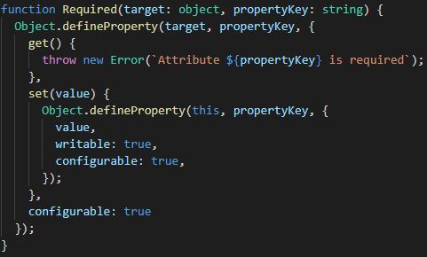

# Ako vytvoriť recyklovateľný element v Angulari
*globálne otepľovanie nie je sranda, musíme sa starať o našu planétu*

Táto krátka príručka je vytvorená pre návod na tvorbu znovupoužiteľných elementov v Angulari.

V zložke *template* je vzorový component

cmd: \
`ng g c sp-mat-nazov-elementu --spec=false`

*--spec=false nevytvorí spec.ts súbor, ktorý je určený na testovanie(v tomto prípdade zbytočný)*

Ideme robiť mnoho rôznych elementov, preto ich mená musia byť jedinečné a nie príliš dlhé

nesprávne:  `sp-mat-button-s-cervenou-farbou`
<br>správne: `sp-mat-btn-red`

Samozrejme iba kvôli tomu, aby bol button červený nepotrebujeme spraviť nový component.<br>
 Atribúty componentu `@Input` a `@Output` budú kľúčové pri
 vytváraní elementov.<br>
Napríklad môžeme použiť input pre class, alebo pre value CSS atribútu jednoducho cez ngStyle a ngClass (tiež cez ngModel)<br>

Na konci tohoto markdownu budú linky pre ďalšie info, ktoré sa môže hodiť

Pre príklad si zoberieme element, na ktorom pracujem aktuálne: Všimol som si, že používame buttony, ktoré vyzerajú rovnako, vždy majú ikonu s &nbsp;`margin-right: 5px`, a button má bootstrap classu (napr btn btn-primary). Síce sa to môže zdať ako banálnosť používať materiál miesto kódu pre button, ale pomáha to čistému kódu, a zabraňuje typo-chybám.

Vytvorím nový component s názvom `sp-mat-btn`, ktorý považujem ako generický pre naše aplikácie (nič sa nemení na tom, že môže podliehať updatom, a môže vyzerať inak)
<br><br>

# Button s ikonou
Môj html bude vyzerať nejako takto:

Aby bol môj komponent ľahko použiteľný vo skoro všetkých prípadoch, použijem `@Input` na atribút class, type, class ikony a text buttonu. 

Atribút `@Output` použijem na funkciu, ktorú chcem, aby button plnil po stlačení. V prípade, že je typ buttonu *submit*, nepotrebujem zadávať tento parameter.

Cez `@Input` viem takisto navoliť predvolenú hodnotu, ak nevyplním pri používaní buttonu tú hodnotu. Stačí iba zadefinovať `@Input`. Je odporúčané, aby sme ju používali vždy - ak sa nevyplní (čo šetrí kód a kopu času), tak je toto ideálne riešenie.

V tomto prípade chceme predvolenú value *button*, pretože je používaná najčastejšie, a aj preto, lebo ak táto hodnota nie je vyplnená, HTML berie tento button automaticky ako *submit* (z dôvodu, že hľadá na stránke button, ktorý nemá pridelený typ "button").


Môj Component bude vyzerať takto:



A tento komponent použitý v inom komponente:



Poznámka: Atribúty, ktoré sú globálne pre HTML ([link](https://www.w3schools.com/tags/ref_standardattributes.asp)) by sa nemali volať tak isto, ako názvy inputov. Napríklad atribút `class`, ktorý som pôvodne použil pre nastavenie classy buttonu nastavoval classu celému komponentu, a nie buttonu. 

# Required
Občas bude treba, aby bol istý parameter vyžadovaný, aby všetko fungovalo správne a/alebo aby sa na nič nezabudlo. Na to som skopčil jednu funkciu zo StackOverflow, ktorá kontroluje, či je tento parameter zadaný, alebo nie. Áno, dá sa ísť na tento problém aj cestou gettrov a settrov, ale vyzerá to lepšie, keď použijeme decorator `@Required` (osobne mi príde že gettre a settre nevyzerajú moc dobre, keď sa na ten kód pozerám)

Takto to vyzerá v praxi: 
```
@Input() @Required class:string;
```


Túto funkciu treba ale dať mimo komponentu, aby sa dala použiť ako  `@Dekorátor`.

Túto funkciu viete nájsť [TU](Required.ts)

# Časté errory

*vymenujem pár errorov, ktoré sa mi stali počas tvorby 1. materiálu, ak by ste mali náhodou ten istý problém*

Pri tvorení tohoto buttonu pomocou atribútov, ktoré bindujem cez angular - `[class]="..."` som omylom pri implementovaní do iného komponentu zabudol dať dvojité úvodzovky => `[type] = "'button'"`. Neskôr som ale aj tak zistil, že toto nie je optimálne, keďže sa to dá použiť aj bez bindovania.

Pri použití VS Code Refactoring (pravý klik, Refactor) aby som nemusel písať gettre a settre skončil `@Input` pred `get()`-trom, a zrazu setter nefungoval. Takže vždy treba dať `@Input` pred `set()`

# Optimalizácia

V angulari je možné dať template HTML-ka do Componentu (nebudeme musieť mať priložený HTML súbor). V praxi to znamená, že vytvoríme element v html súbore, ale iba ho jednoducho priložíme do Componentu, a nebudeme musieť ťahať so sebou viac súborov. Takisto s CSS (ak je nejaká class vytvorená)

# Linky na pozretie

[NgClass](https://angular.io/api/common/NgClass) &nbsp; 
[NgStyle](https://angular.io/api/common/NgStyle) &nbsp;
[@Input](https://angular.io/api/common/Input) &nbsp;
[@Output](https://angular.io/api/common/Output) &nbsp;
[EventEmitter](https://angular.io/api/core/EventEmitter) &nbsp;
[Getters and Setters in Angular](https://andrew-morozw.medium.com/using-getters-and-setters-in-typescript-and-angular-d478829461c8) &nbsp;


